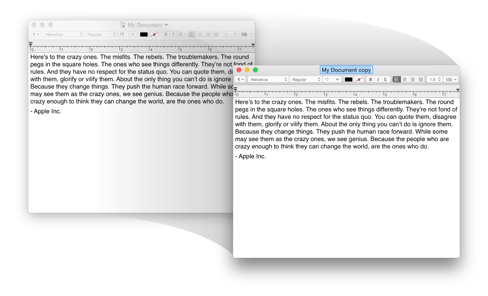

# 动画

OS X 使用优美且有意义的动画作为反馈，让用户感知操作的结果。如果你用的是系统的控件，系统已经自带动画了。如果你想自己做动画，那你应该以提升认知清晰度和沟通流畅度为设计目标。

举个例子，如果用户在 TextEditor 里面复制了一个文档，复制出来的副本就会从原来的窗口跳出来，创建一个新的窗口，并激活该窗口。

**避免没有必要的动画。** 不必要或者不合逻辑的动画会很快让用户感到厌恶甚至烦躁。所以你得确保加上去的动画效果都是为了加强用户对功能的理解而设计的。

**不要让动画喧宾夺主，抢占用户太多的关注。** 除非你是在做一款游戏，你可以用各种美妙的动画来吸引用户。但是对与普通应用来说，过多的动画效果反而会分散用户的注意力，得不偿失。最好的动画效果应该在不过分引人注意的前提下帮助用户更好地理解应用。

**利用动画告知用户当前操作可能造成的影响。** 在用户还没真正执行这个操作之前就先展示结果可以让用户树立信心，同时避免犯错。举个例子，当用户把一个图标拖到 Dock 上的时候，其他的图片都会让开空出一个位置，让用户知道当他松开鼠标的时候这个图标会放在哪里。

**当窗口进出全屏模式的时候，可以使用动画做过渡。** 通常系统默认的过渡效果已经够用了，但是如果你的应用有些自定义控件在默认动画下效果不佳的时候，你可以自己设计一个更平滑的动画。比如说，假设在工具栏下面有一个附属工具栏（比如收藏夹），这时候就要确保收藏夹的在全屏动画过程中要一直贴在工具栏下面。

**多用逼真的物理效果。** 有时候逼真的物理效果甚至比逼真的图像要管用。举个例子，OS X 就使用回弹效果（rubber band effect，橡皮圈效果）来告知用户现在已经滚动到窗口的底部了，或者已经滚到最后一个桌面了。把物理效果用在界面上可以让你的用户更容易理解发生了什么。

**利用动画来展示一个 UI 元素的状态变化。** 当 UI 元素从一种状态转到另一种状态的时候，可以用动画来做过渡。这样可以让用户更好地理解界面上发生了什么，能给人一种更好的控制感。（译者注：比如说 VPN 连接的时候，有连接中，校验中，已连接等几种状态，OS X 就使用动画对其状态的变化做了过渡效果。）

**当一个操作快到用户看不到的时候，可以用动画来让用户察觉到这种变化。** 比如说窗口的最小化，对机器来说就是一条指令的事情，但是窗口如果突然消失，对用户来说是无法理解发生了什么的。所以我们可以用流畅的缩小动画（译者注：OS X的窗口最小化效果被称为 Genie Effect）来作为过渡，帮助用户理解这一行为。 

**避免在常用的系统控件上做动画。** 用户早就熟知这些系统控件的行为，如果每点一次按钮或者切换一次 tab 都要花时间看动画就太烦了。（译者注：如果切换动画足够快其实还是挺好接受的。）

**不要对所有事情都做动画。** 理想很丰满：更多的动画意味着更加清晰的理解和更好的反馈。但是现实很骨感：通常情况下用户根本不用这么多动画来帮助理解。绝大多数的操作都应该以最快的速度响应，而不是把时间花在华而不实的动画上。