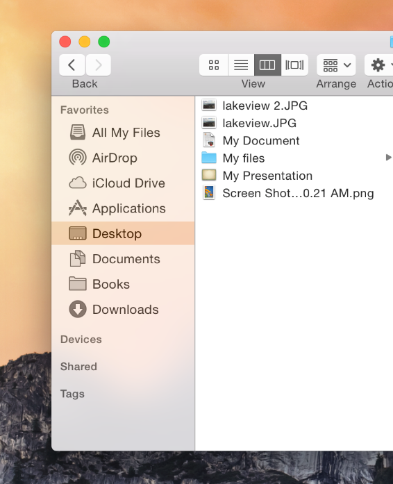

# 颜色与字体

## 在系统定义的界面上要多用系统提供的颜色

系统提供的颜色专为系统界面量身定做，比如菜单和悬浮层的背景颜色会自动使用窗口下面的颜色来作模糊（Vibrancy）效果。比如系统的通知中心就使用了系统提供的文本色（[textColor]()）和控件文本色（[controlTextColor]）这些系统颜色，可以在 Vibrancy 效果下取得很好的显示效果（译者注：比如深色部分背景文本自动变浅，浅色背景部分文本自动加深）。使用系统颜色，你可以不用担心文本在不同环境下的显示效果。

另一个系统颜色应用的例子就是采用了 Light Vibrancy 效果的 Finder 侧边栏，系统自动提取了桌面的颜色来渲染侧边栏的背景和字体颜色。

	重要提示
	如果用户修改了系统辅助选项里的“提高对比度”和“降低透明度”选项，系统的颜色可以自动响应这些变化。你也可以通过监听 NSWorkspaceAccessibilityDisplayOptionsDidChangeNotification 这个通知来响应这些变化。

**准备好使用 Vibrancy 效果。** Vibrancy 和半透明效果的影响是全局的，即使是没有用到 Vibrancy 效果的那些应用，也会因为部分系统控件默认使用了 Vibrancy 而被影响到。为了在 Vibrancy 下取得更好的显示效果，你应该多用系统提供的颜色，多用模板图片（Template Image，译者注：模板图片可以对图片的形状自动填充需要的颜色，比如系统菜单栏里的图标，平时是黑色，深色模式下会自动变成白色。），少用自定义的颜色和彩色图片。（如果你不想用 Vibrancy 效果，你可以通过声明 [NSAppearanceNameAqua]() 去掉所有 Vibrancy 效果。）

	重要提示
	模板图片可以使用 Vibrancy 效果，全彩图片则不可以。所以在通常会用上 Vibrancy 效果的工具栏或者侧边栏这些地方，使用全彩图片要先三思了。（更多关于工具栏和侧边栏的信息，请参见[工具栏设计]()和[资源列表]()。）

**用系统颜色来区分不同文本的重要性。**  Yosemite 根据重要性定义了四种等级的系统颜色，虽然这些颜色的命名都带有 label 字样，但其实这些颜色都可以用在非文本界面上。四种颜色的命名如下：

- labelColor （译者注：这是最高级别的颜色，最深）
- secondaryLabelColor
- tertiaryLabelColor
- quaternaryLabelColor

下面的例子展示了这四中级别的颜色在深浅两种 Vibrancy 场景中的效果：

比如系统的邮件应用就使用 labelColor 作为邮件发送者和主题的颜色，以此跟邮件内容做区分。而对邮件来说重要程度最低的分隔线，则使用了 quaternaryLabelColor。

**关注系统颜色的应用场景。** 系统提供的颜色除了 redColor, blueColor 等这些以颜色本身命名的之外，还提供了很多以应用场景命名的颜色，比如说 controlTextColor （控件文本色）和 selectedTextColor (被选中的文本色)。如果你使用颜色的时候能够关注颜色的使用场景，那么即使 OS X 更新了系统的样式，你的应用也还是可以保持和谐的视觉效果。

**关注不同场景下的对比度。** 如果一个视图的前后景没有足够的对比度，就会变得很难阅读。要检查你的应用的对比度是否足够大，有一个不太科学但是挺有效的方法——在不同的关照条件下测试应用里的文字能否看清，比如直接放到太阳光下看看会不会反光之类的。

不过这样也只能帮你找找有哪些可以改进的地方，却做不到更全面彻底的检查。所以，最保险的做法是检查你的前后景两种颜色的亮度比，你可以直接用一些网上提供的亮度比计算器来做计算（译者注：搜一下挺多的，输入两种颜色值自动计算比值），或者你也可以直接通过查 WCAG2.0 标准规定的亮度值再代入公式自己算一下（译者注：[Web Content Accessibility Guildelines](http://www.w3.org/TR/WCAG20/)），理想的亮度比应该要在 4.5:1 以上。

## 应用里的文本都应该清晰可辨

Yosemite 系统提供了一种优化过的 Helvetica Neue 字体，给所有文本提供无与伦比的可辨性，清晰度以及一致性。Yosemite 的这种优化已经权衡过美学与布局上的考虑，所以绝大多数的应用不用做任何改动就能获得很好的效果。而且用了 Auto-Layout（自动布局）的应用，如果一个视图发生了变化，系统还会自动调整字体的显示矩阵，以获得最佳显示效果。

	重要提示
	使用系统字体的时候请用 systemFontOfSize: 或者 boldSystemFontOfSize: 这样的方法，这些指名用 systemFont 的方法返回的就是优化过的系统字体，而定义时指明用 “Helvetica Neue” 的字体系统是不会帮你做优化的。这种指明字体名字的方式可以用在文档编辑里面，但是用在通用界面上的话可能显示效果就不符合预期了。